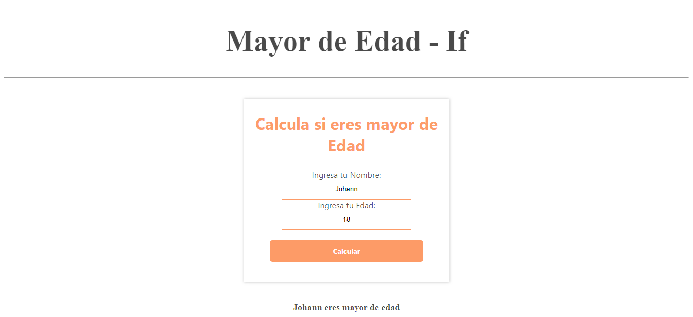
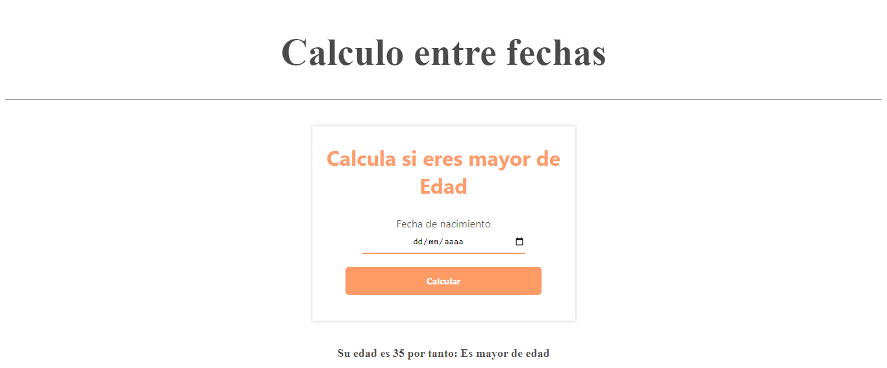
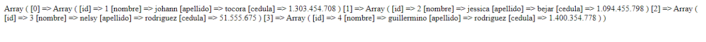

<h1>Taller 10: Johann Alberto Tocora Rodriguez</>

<h2>Información</h2>

Curso Full Stack Básico - Grupo 1

Profesor: Cristian Patiño 

<h2>Punto 1: </h2>
<h3>Calculadora</h3>

<h2>Punto 2: </h2>
<h3>Calculo mayor de edad</h3>

<h2>Punto 3: </h2>
<h3>Captura e Impresión de datos de Usuario</h3>

<h2>Punto 4: </h2>
<h3>Calculo entre Fechas</h3>

<h2>Punto 5-6-7: </h2>
<h3>5 - Base de datos</h3>

<h3>6 - Conexión</h3>

<h3>7 - Muestra de datos en Pantalla</h3>

